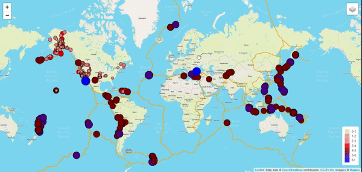

# Earthquake_Mapping
A simple project with JS Leaflet package to visualize Earthquake data with API

#### Purpose
I wanted to show the differences among the magnitudes of earthquakes world-wide for last week.

#### Tasks
I retrieved the earthquake data from USGS website in a GeoJSON format, which includes the coordinates and magnitudes of the earthquake. Then I added the data into a map generated from MapBox API.

#### Approach
I used D3 library in JS to retrieve informations from the GeoJSON data. I plotted the base and overlay maps and added the interactivity for analyzing earthquake using the JS Leaflet library and Mapbox map.

### Webpage

https://www.loom.com/share/fbe3277b3bd8434bb1fcb5c514eee7a5

https://github.com/mahmud-nobe/Earthquake_Mapping/blob/main/Earhquake_Mapping.mp4

